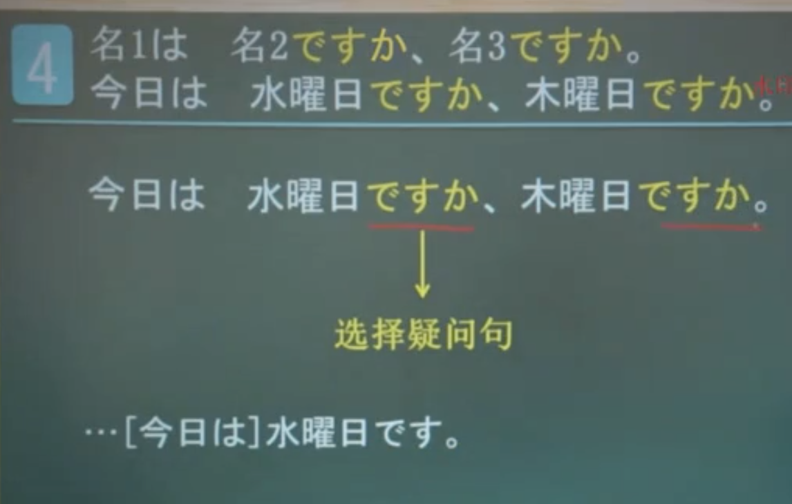

### 数字

- 0 ねい/ゼロ
- 1 いち
- 2 に
- 3 　さん
- 4 　し/よん
- 5 　ご
- 6 　ろく
- 7 　しち/なな
- 8 　はち
- 9 　きゅう/く
- 10 　じゅう

|     |              |      |            |             |                    |
| --- | ------------ | ---- | ---------- | ----------- | ------------------ |
| 100 | ひゃく　     | 1000 | せん       | 10,000      | いちまん           |
| 200 | にひゃく　   | 2000 | にせん     | 100,000     | じゅうまん         |
| 300 | さんびゃく   | 3000 | さんせん   | 1,000,000   | ひゃくまん         |
| 400 | よんひゃく   | 4000 | よんせん   | 10,000,000  | いっせんまん       |
| 500 | ごひゃく     | 5000 | ごせん     | 100,000,000 | いちおく           |
| 600 | ろっひゃく   | 6000 | ろくせん   | 9002        | きゅうせんに       |
| 700 | ななひゃく   | 7000 | ななせん   | 9020        | きゅうせんにじゅう |
| 800 | はっびゃく   | 8000 | はっせん   | 9200        | きゅうせんにひゃく |
| 900 | きゅうひゃく | 9000 | きゅうせん |             |

### 年龄

###　价格

>　〜円(えん)：日语的货币单位 

- 1円 いちえん
- 4円 よえん
- 5円 ごえん
- 10円　じゅうえん
- 50円　ごじゅうえん
- 100円　ひゃくえん
- 500円　ごひゃkえん
- 1000円　せんえん
- 10,000円　いちまんえん
- 10,000,000円　いっせんまんえん

> 〜はいくらですか　什么什么多少钱

> いくつ 岁
> 〜はいくらですか 多少岁

### 地点指示代词

|        | 地点指示代词 | 指示代词   | 含义　 |
| ------ | ------------ | ---------- | ------ |
| 近称   | ここ　       | 　こちら　 | 这路   |
| 中称   | そこ　       | 　そちら   | 那里   |
| 远称   | あそこ       | 　あちら   | 那里   |
| 疑问称 | どこ         | 　どちら   | 哪     |

#### 例句

1. 这里是哪里

> ここはどこですか

> 傘売り場です

2. 这里是相机部门吗

> ここはカメラ売り場ですか

> はい、カメ売り場です

### 表示方向

- こちら　---- 这个方向
- そちら　---- 那个方向
- あちら　---- 那个方向
- どちら　---- 哪个方向

> 例句 こちらへどうぞ 像这个方向走

### 表示地点

更礼貌一些

- こちら　---- 这里
- そちら　---- 那里
- あちら　---- 那里
- どちら　---- 哪里

#### 例句

1. 这里/那里是学校

> ここ・そこ・あそこ　は学校(がっこう)です
> こちら・そちら・あちら　は学校(がっこう)です

2. 你的家乡在哪里

> お国はどこですか
> お国はどちらですか

### 表示对人的敬称

1. 这位是田中先生

この人(ひと)は田中(たなか)さんです
こちらは田中(たなか)さんです

### 场所

1. 这里厕所

> ここはトイレです

2. 小李在厕所

> 李さんはトイレです

3. 银行在哪啊

> バンタはどこですか

4. 请问洗手间在哪

> お手(て)洗い(あら)[は]どこですか

## も

提示组词，“也”的意思

### 例句

1. 这个人是学生

> この人は学生です

2. 那个人也是学生

> その人も学生です

## 选择疑问句

### 例句

### ～ですか

1. 表示确定(升调 ⬆️)
   用于进一步确定对方所说的信息

> あのう、東京の地図はどこですか。
> 地図ですか。そちらです。

2. 表赞同(降调 ⬇️)
   在对方所说的内容后加[か]
   表示理解了对方所说的内容

> それはパソコンです
> パソコンですか
