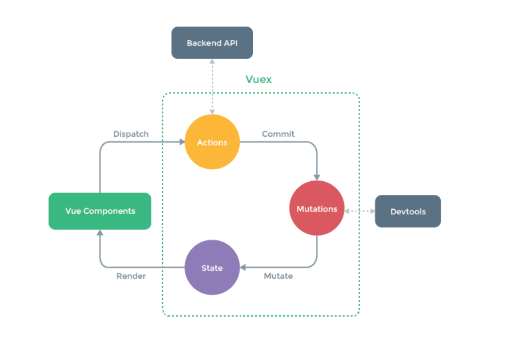

# vue

## vuex



### 思考

- vuex的定义
- vuex解决了什么问题
- 什么时候需要vuex
- 具体用法
- vuex原理

### 回答

- Vuex是一个专为Vue.js应用程序开发的状态管理模式。它采用集中式存储管理应用的所有组件的状态，并以相应的规则保证状态以一种可预测的方式发生变化
- 主要解决多组件之间状态共享的问题，保证了多个组件状态的一致性，保证单向数据流动，使代码更结构化且易于维护
- vuex实现：new vue实例，将state作为data对其进行响应式处理

## 组件同行

- props
- $emit/$on
- $children/$parent
- $attrs/$listeners
- ref
- $root
- eventbus
- vuex

### 组件关系通信

- 父子
  - props
  - $emit/$on
  - $children/$parent
  - $attrs/$listeners
  - ref
- 兄弟
  - $root
  - $parent
  - eventbus
  - vuex
- 跨层级
  - eventbus
  - vuex
  - provide/inject

## vue-router

- vue-router中路由保护策略

- 路由安全通常使用导航守卫来做，通过设置路由导航钩子函数的方式添加守卫函数，在里面判断用户的登录状态和权限，从而达到保护指定路由的目的
- 实现
  - 全局前置守卫beforeEach
  - 路由独享守卫beforeEnter
  - 组件内守卫beforeRouteEnter
- 过程
  - 全局守卫可以使用router.beforeEach((to, form, next)=>{})设置守卫，每次路由导航时，都会执行该守卫，从而检查当前用户是否可以继续导航，通过给next函数传递多种参数达到不同的目的，比如如果禁止用户继续导航可以传递next（false），正常放行可以不传递参数，传递path字符串可以重定向到一个新的地址等等
- 生效方式：比如beforeEach只是注册一个hook，当路由发生变化，router准备导航之前会批量执行这些hooks，并且把目标路由to，当前路由from，以及后续处理函数next传递给hook

- 全局守卫、路由独享守卫和组件内守卫
  - 作用范围
  - 组件实例的获取
    - beforeRouteEnter内可以获取到vm组件实例
  - 名称/数量/顺序
    - 导航被触发
    - 在失活的组件里调用离开守卫
    - 调用全局的beforeEach守卫
    - 在重用的组件里调用beforeRouteUpdate守卫
    - 在路由配置里调用beforeEnter
    - 解析异步路由组件
    - 在被激活的组件里调用beforeRouteEnter
    - 调用全局的beforeResolve守卫
    - 导航被确认
    - 调用全局的afterEach钩子
    - 触发DOM更新
    - 用创建好的实例调用beforeRouteEnter守卫中传给next的回调函数
- 项目中路由守卫的应用
- 前后端路由一样吗
- 前端路由是用什么方式实现的
- 路由守卫的next方法是怎么实现的

## 设计原则

- 渐进式JS框架
- 易用、灵活、高效

### 易用性

### 灵活性

### 高效性

- 虚拟dom
- diff算法

## vue中key

- 确定唯一的dom元素

- 首位判断假猜策略

key的作用是为了高效的更新虚拟DOM，其原理是vue在patch过程中通过key可以精准判断两个节点是否是同一个，从而避免频繁更新不同元素，减少dom操作，提高性能；
并且没有key值可能会在列表更新时引发一些隐藏bug；
在使用相同标签元素的过度切换时，也会用到key属性，其目的也是为了让vue可以区分它们，否则vue只会替换其内部属性而不会触发过渡效果

## 性能优化

### 路由懒加载

```js
const router = new VueRouter({
  routes:[
    {path: '/foo/', component: ()=>import('./Foo.vue')}
  ]
})
```

### keep-alive缓存页面

```html
<keep-alive>
  <router-view />
</keep-alive>
```

### 使用v-show复用DOM

### v-for和v-if

> 源码compiler/codegen/index.js

- v-for优先于v-if
- 同时出现时，每次渲染都会先执行循环再判断条件，无论如何循环都不可避免，浪费了性能

- 避免这种情况
  - 先v-if在做循环
  - 如果是v-for内部的组件需要判断v-if，则可以先处理数据，在给template循环

### 长列表

- 存粹的数据展示，使用Object.freeze冻结数据

- 虚拟滚动
  - vue-virtual-scroller
  - vue-virtual-scroll-list

```html
<recycle-scroller>
</recycle-scroller>
```

### 事件销毁

- 消除定时器

### 图片懒加载

- vue-lazyload

### 第三方组件按需引入

### 无状态组件

- 函数式组件

```html
<template functional>
</template>
```

### 子组件分割

- 更新频繁的组件拆分出去，更新时只更新自己的状态

### 变量的本地化

- 外部传入的数据，在自组件中使用变量接收，不会频繁的取去引用props计算属性

### SSR

## nextTick

### 思考

- nextTick是啥
- 为什么需要nextTick，用异步更新队列实现原理解释
- 在什么地方用到它
- 如何使用nextTick
- nextTick的源码实现

### 回答

- 延迟回调：在下次DOM更新循环结束之后执行延迟回调，在修改数据之后使用这个方法，可以立即获取更新后的DOM状态
- nextTick是一个全局API，由于vue的异步更新策略导致对数据修改之后不会立刻体现在dom变化上，此时如果想要立即获取更新后的dom状态，就需要使用这个方法
- vue在更新dom时是异步执行的。只要侦听到数据变化，vue将开启一个队列，并缓冲在同一事件循环中发生的所有数据变更。如果同一个watcher被多次触发，只会被推入到队列中一次。这种在缓冲时去除重复数据对于避免不必要的计算和dom操作时非常重要的。nextTick方法会在队列中加入一个回调函数，确保该函数在前面的dom操作完成后才调用
- 实现：在callback里加入我们传入的函数，然后用timerFunc异步方式调用他们，首选的异步方式会是Promise

## vue响应式

### 思考

- 什么是响应式
- 为什么需要响应式
- 能带来什么好处
- vue的响应式怎么实现的，有什么缺点
- vue3响应式的变化

### 回答

- 概念：能够使数据在变化时可以被检测到并对这种变化做出相应的机制
- mvvm框架要解决的核心问题就是连接数据层和视图层。因为mvvm框架是一个胶水层，解决model和view层的耦合关系，提高生产力。通过数据驱动应用，数据变化，视图更新，要做到这点就需要对数据做响应式处理，这样一旦数据发生变化就可以立即做出更新处理
- vue为例，通过数据响应式加上虚拟dom和patch算法，是我们只需要操作数据，不用频繁做dom操作，提升开发效率，降低开发难度
- vue2的数据响应式会根据数据类型来做不同的处理，如果是对象则采用Object.defineProperty()的方式定义数据拦截，当数据被访问或发生变化时，做出相应。数组则是通过覆盖数组原型的方法，扩展它的7个变更方法，使这些方法可以额外的做更新通知，从而做出响应。缺陷：初始化时递归遍历会造成性能损失，新增或删除属性时需要使用Vue.set/delete这样特殊的api才能生效；对es6中新产生的Map、Set这些数据结构不支持等问题
- vue3：利用es6的Proxy（支持对象和数组）机制代理要响应化的数据，它有很多好处，编程体验是一致的，不需要使用特殊api，初始化性能和内存消耗得到大幅改善。由于响应式的实现抽取为独立的包，可以更灵活的使用它，抽出公共的逻辑代码。
  - Proxy只对数据外层包裹了一个壳，没有对数组或者对象内部的元素进行代理，当使用到内部的元素时才会去创建Proxy对其响应，因此降低了cpu的使用和内存消耗

---

# vue3

## 新特性

- 更快
  - 虚拟DOM重写
  - 优化slots的生成
  - 静态树提升
  - 静态属性提升
  - 基于proxy响应式
- 更小
  - 通过摇树优化核心库体积
- 更容易维护
  - ts + 模块化
- 更友好
  - 跨平台： 编译器和运行时核心与平台无关，使vue更容易与任何平台（Web、Android、Ios）一起使用
- 更容易使用
  - ts
  - 更好的调试支持
  - 独立的响应式模块
  - Composition API
    - 逻辑复用

### 虚拟DOM重写

### 插槽

